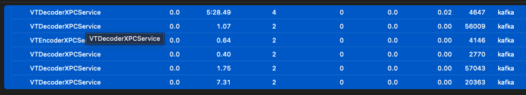
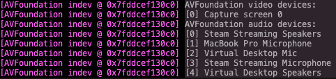
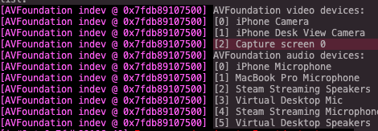
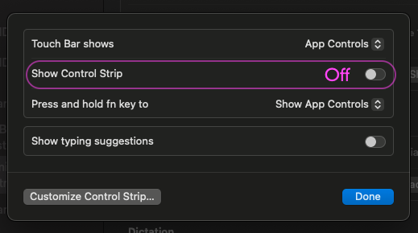
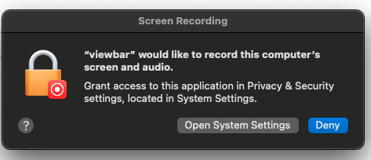
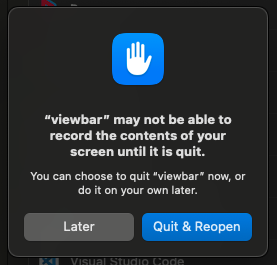

# disclamers/known issues:
- electron, VTDecoderXPCService, and ffmpeg processes "sometimes" does not close properly 
Can be closed manually in activity monitor:

- the touchbar recording doesnt start 
ffmpeg records the screen based on device id, best chance is to disconnect all other capturable devices (includes iphone camera), (Another option is to change source code and modify (`screenIndex  =`) to force desired capture device.) check with ffmpeg that device id is matching:

- to get more screen real-estate

# permission for screen recording needs to be granted:

