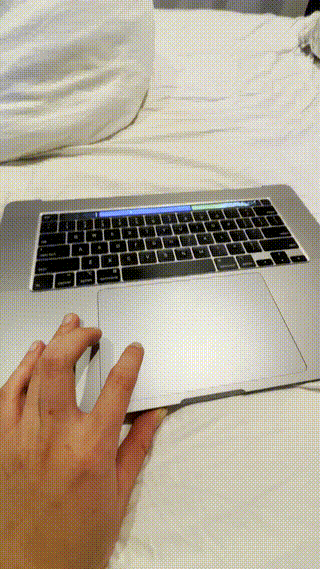

# Touchbar Screen Mirror.

uses ffmpeg and electron built with npm.

## Running
Download from [release](https://github.com/Shubin123/viewbar/releases), consider system permissions see [Disclamers](./extras/readme.md). 

## Developing (needs node v18 & npm v10)
`git clone https://github.com/Shubin123/viewbar` 

`npm install`

`npm run start`

`npm run package` (to build)

## [Known Issues](./extras/readme.md)
mostly related to the mac operating system

### License for this project is present in the root directory (LICENSE).
 
## screenshots:

 

 (runs fully headless (requires virtual display and patience))
